-   [Project 1: NYC Community Health Survey 2020: HIV Testing and Condom
    Use](#project-1-nyc-community-health-survey-2020-hiv-testing-and-condom-use)
-   [Executive Summary](#executive-summary)
-   [1. Introduction](#introduction)
-   [2. Data Description](#data-description)
-   [3. Data Preparation](#data-preparation)
    -   [3.1 Import Data](#import-data)
    -   [3.2 Assign and Create Variables](#assign-and-create-variables)
    -   [3.3 Data Cleaning](#data-cleaning)
-   [4. Exploratory Data Analysis (EDA)](#exploratory-data-analysis-eda)
    -   [4.1. Summary Table](#summary-table)
    -   [4.2 Bar Charts](#bar-charts)
    -   [4.3 Pie Charts](#pie-charts)
    -   [4.4 Box Plots](#box-plots)
    -   [4.5 Summary Report](#summary-report)
-   [5. Statistical Modeling](#statistical-modeling)
    -   [5.1 Unadjusted Logistic
        Regression](#unadjusted-logistic-regression)
    -   [5.2 Adjusted Logistic
        Regression](#adjusted-logistic-regression)
    -   [5.3 Adjusted LRM Table](#adjusted-lrm-table)
-   [6. Discussion](#discussion)
-   [7. Conclusion](#conclusion)
-   [8. Refrences and Resources](#refrences-and-resources)

# Project 1: NYC Community Health Survey 2020: HIV Testing and Condom Use

**Rawda Alaswad**  
**Date:** July 15, 2025

# Executive Summary

This report analyzes data from the 2020 New York City Community Health
Survey (CHS) to examine demographic and behavioral factors associated
with HIV testing among adults in NYC. The survey included approximately
10,000 adults, with data collected via a cross-sectional, self-reported
telephone survey in multiple languages.

Key variables analyzed include race/ethnicity, age group, HIV testing in
the past 12 months, condom use, and number of sex partners. Data were
cleaned and recoded for clarity, and survey weights were applied to
account for the complex sampling design.

Descriptive analyses showed that the largest racial/ethnic group was
White/North African/Middle Eastern, non-Hispanic, and most participants
were aged 25–64. Only 28.6% of respondents reported being tested for HIV
in the past year, and 17.3% reported condom use at last sex.

Logistic regression models were used to assess associations between HIV
testing and behavioral/demographic factors. In un-adjusted analysis,
condom use was significantly associated with higher odds of HIV testing.
However, after adjusting for age group, race/ethnicity, and number of
sex partners, this association was no longer statistically significant.
Black, Hispanic, and Other non-Hispanic participants, as well as those
with more sex partners, were more likely to have been tested for HIV,
while older age groups were less likely.

These findings highlight disparities in HIV testing and suggest the need
for targeted public health interventions to increase testing rates among
specific demographic groups in NYC.

# 1. Introduction

This report utilizes data from the 2020 New York City Community Health
Survey (CHS) to explore patterns of HIV testing among adults in NYC. The
analysis focuses on the relationships between HIV testing and key
variables such as race/ethnicity, age group, condom use, and number of
sex partners. By identifying groups with lower testing rates and
examining associated behaviors, this study aims to provide actionable
insights for improving HIV prevention and care in NYC.

# 2. Data Description

**Source:** The data used in this project is the New York City Community
Health Survey (CHS) of 2020, conducted annually by the NYC Department of
Health and Mental Hygiene (DOHMH).
<https://www.nyc.gov/site/doh/data/data-sets/community-health-survey-public-use-data.page>

**Sample Size:** The survey includes approximately 10,000 adults aged 18
and older, residing in New York City and its five boroughs.

**Collection Method:** Data were collected via a cross-sectional,
self-reported telephone survey. Interviews were conducted in English,
Spanish, Russian, and Chinese (Mandarin and Cantonese).

**Variables Key:**

| Original Variable Name | Recoded Name/ Label | Description |
|------------------------|------------------------|------------------------|
| newrace | Race/Ethnicity | Self-identified race/ethnicity of participant |
| agegroup | Age Group | Age group in years |
| hiv12months20 | Tested for HIV (Past 12 Months) | Whether participant was tested for HIV in past 12 months |
| condom20 | Condom Use (Past 12 Months) | Whether participant used a condom the last time they had sex |
| sexpartner | Number of Sex Partners (Past 12 Months) | Number of sex partners in the past 12 months |

**Statistical Methods:** Survey weights and design variables were used
to account for the complex sampling design. Descriptive statistics,
summary tables, and visualizations were produced. Logistic regression
models (both unadjusted and adjusted for confounders) were fitted using
the ‘survey’ package in R to assess associations between HIV testing and
behavioral/ demographic factors.

**Libraries Used:**

# 3. Data Preparation

## 3.1 Import Data

-   The data was downlaoded on to local harddrive from the NYC CHS
    website (2020 SAS Data File named chs2020_public.sas7bdat). The data
    set was assigned the named chs20 for this project.

## 3.2 Assign and Create Variables

-   Assigning numeric values to the categories of each factor to reocde
    them for the epi table. The recoded data set is called chs20_recode.

## 3.3 Data Cleaning

-   The recoded data was checked to ensure that the recoding process was
    completed correctly and that all variables and cases are present.

<!-- -->

    ##                          Race/Ethnicity                               Age Group 
    ##                                       0                                      14 
    ##         Tested for HIV (Past 12 Months)             Condom Use (Past 12 Months) 
    ##                                     152                                    3688 
    ## Number of Sex Partners (Past 12 Months) 
    ##                                     861

    ## [1] "Race/Ethnicity"
    ## 
    ## White/N Afri/MidEastern, non-Hispanic                   Black, non-Hispanic 
    ##                                  2859                                  1837 
    ##                              Hispanic                Asian/PI, non-Hispanic 
    ##                                  2457                                  1340 
    ##                   Other, non-Hispanic 
    ##                                   288 
    ## [1] "Age Group"
    ## 
    ## 18-24 25-44 45-64   65+  <NA> 
    ##   706  3189  2951  1921    14 
    ## [1] "Tested for HIV (Past 12 Months)"
    ## 
    ##   No  Yes <NA> 
    ## 6122 2507  152 
    ## [1] "Condom Use (Past 12 Months)"
    ## 
    ##   No  Yes <NA> 
    ## 3570 1523 3688 
    ## [1] "Number of Sex Partners (Past 12 Months)"
    ## 
    ##    1    2    3    4 <NA> 
    ## 2686 4263  374  597  861

# 4. Exploratory Data Analysis (EDA)

## 4.1. Summary Table

|  | Race/Ethnicity | Age Group | Tested for HIV (Past 12 Months) | Condom Use (Past 12 Months) | Number of Sex Partners (Past 12 Months) |
|:--|:-------------------|:-----|:--------------|:------------|:-----------------|
|  | White/N Afri/MidEastern, non-Hispanic:2859 | 18-24: 706 | No :6122 | No :3570 | 1 :2686 |
|  | Black, non-Hispanic :1837 | 25-44:3189 | Yes :2507 | Yes :1523 | 2 :4263 |
|  | Hispanic :2457 | 45-64:2951 | NA’s: 152 | NA’s:3688 | 3 : 374 |
|  | Asian/PI, non-Hispanic :1340 | 65+ :1921 | NA | NA | 4 : 597 |
|  | Other, non-Hispanic : 288 | NA’s : 14 | NA | NA | NA’s: 861 |

Epidemiological Summary Table

## 4.2 Bar Charts

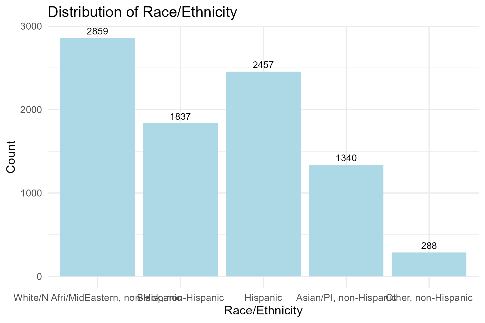 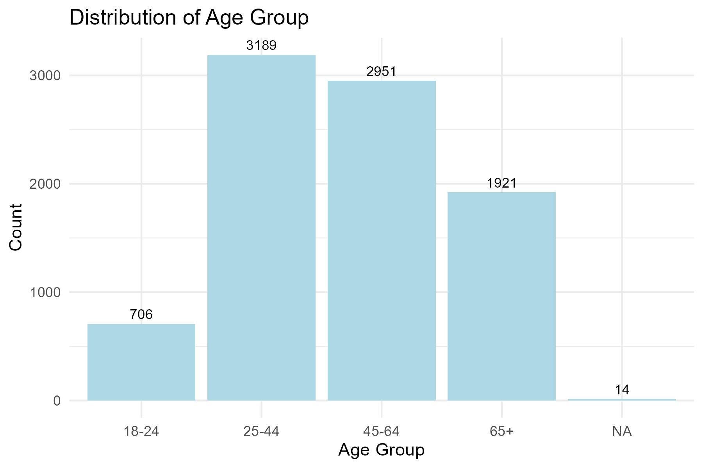
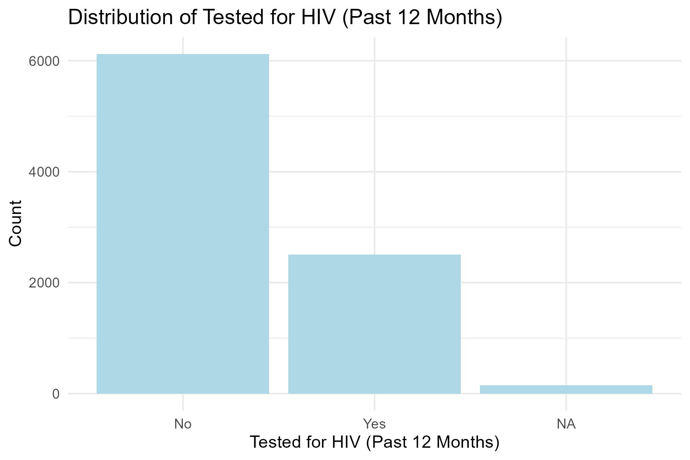 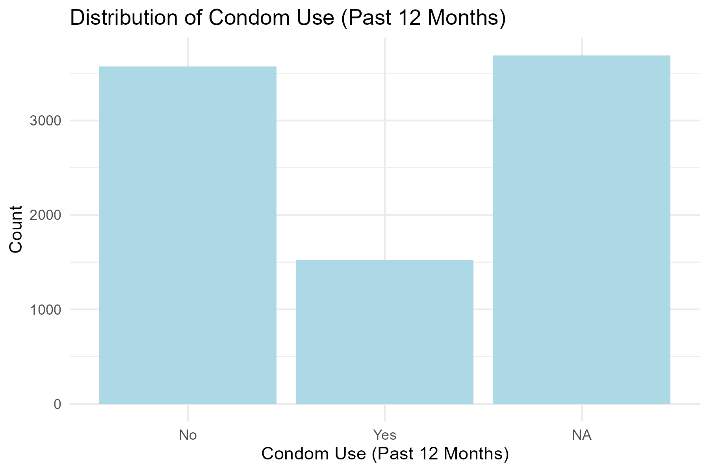
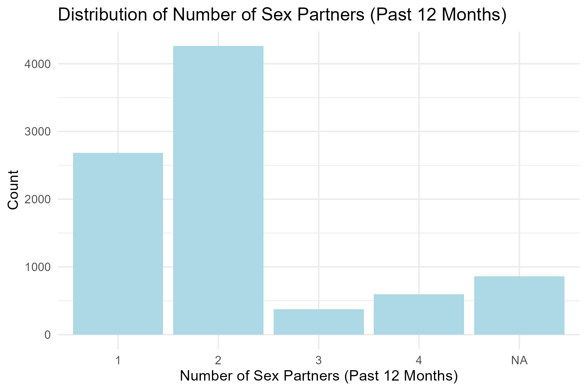

## 4.3 Pie Charts

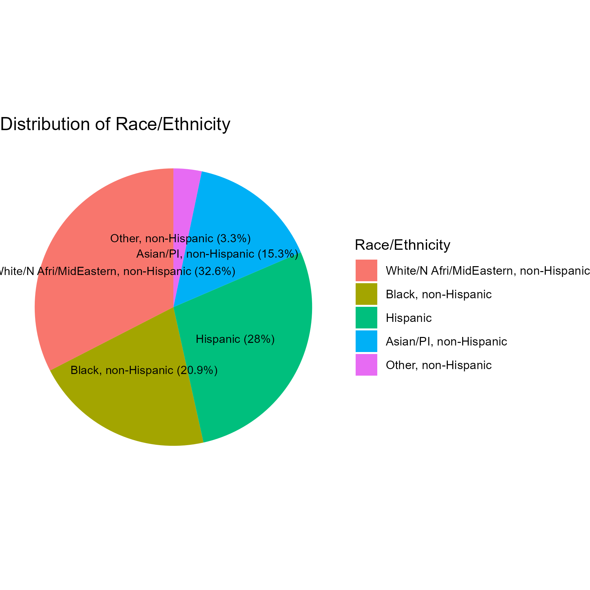 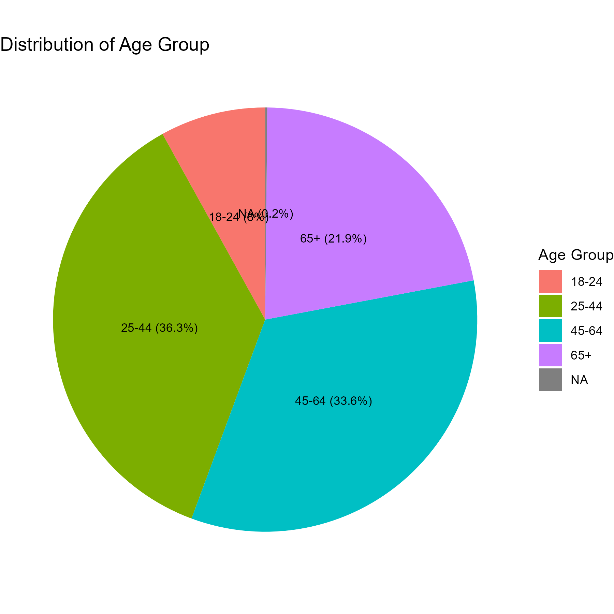
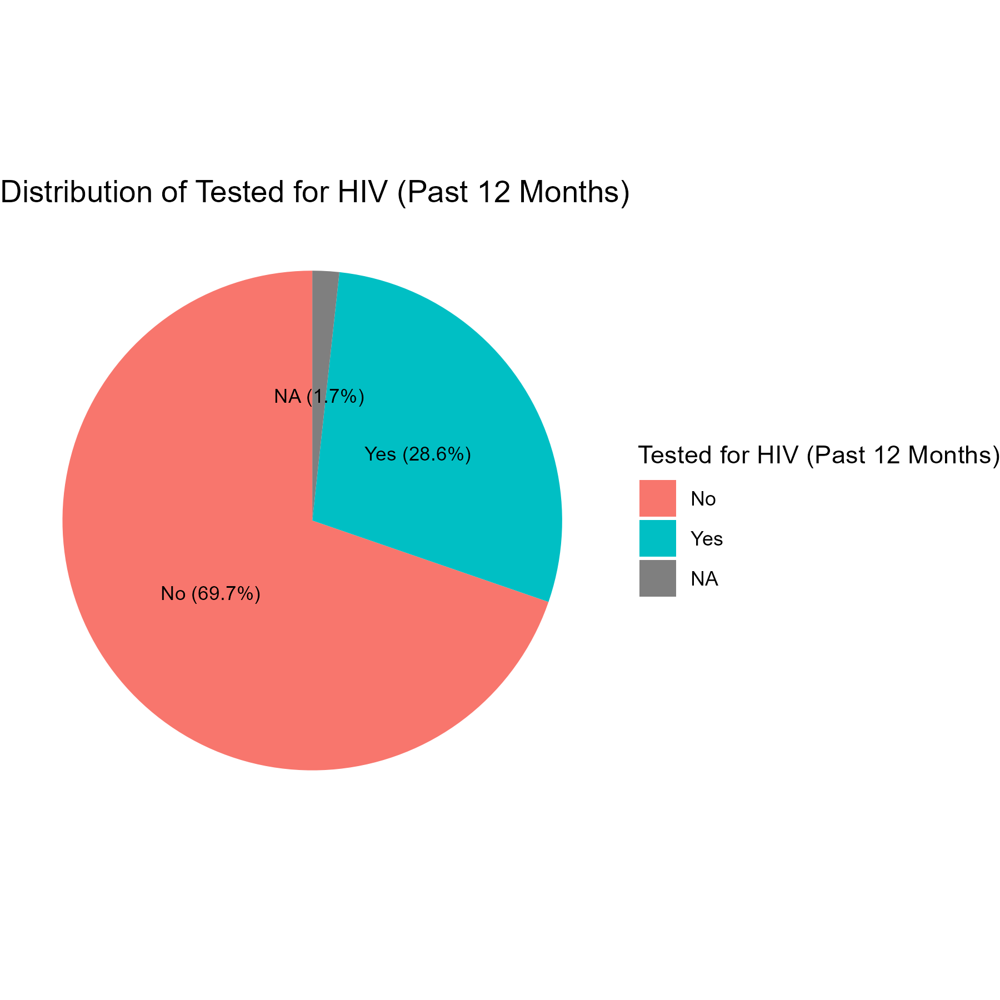 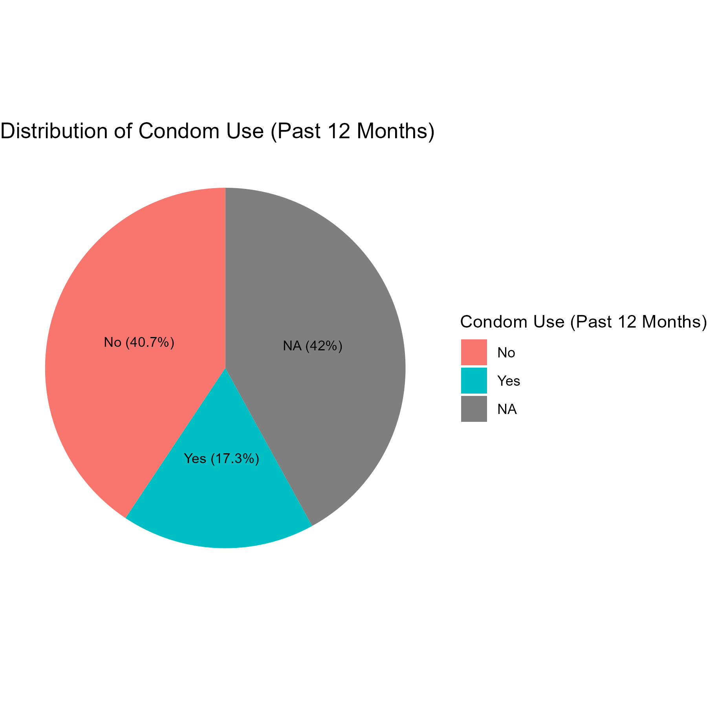
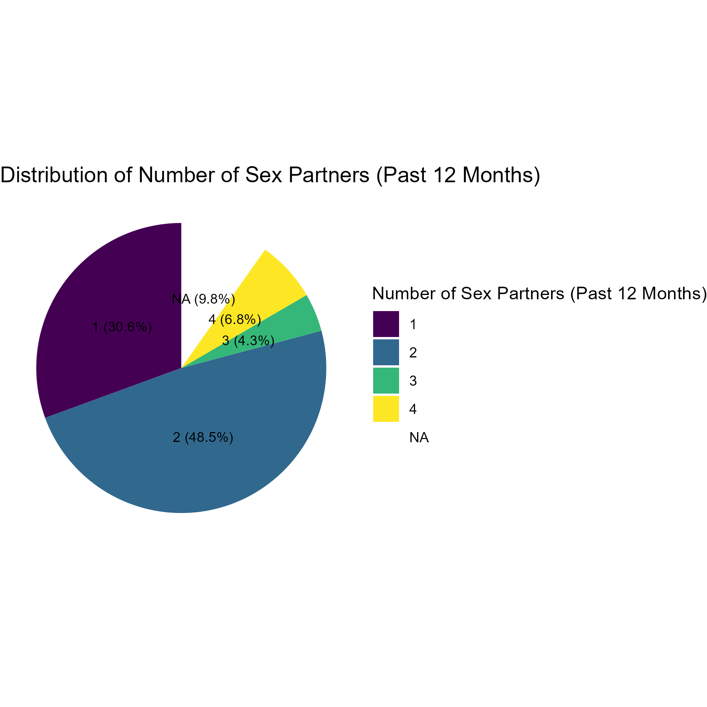

## 4.4 Box Plots

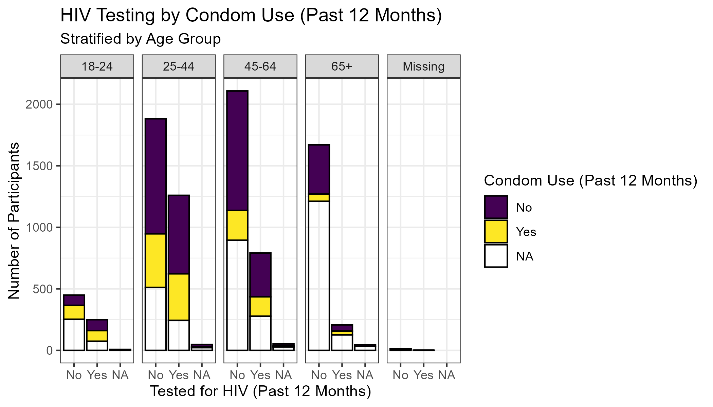
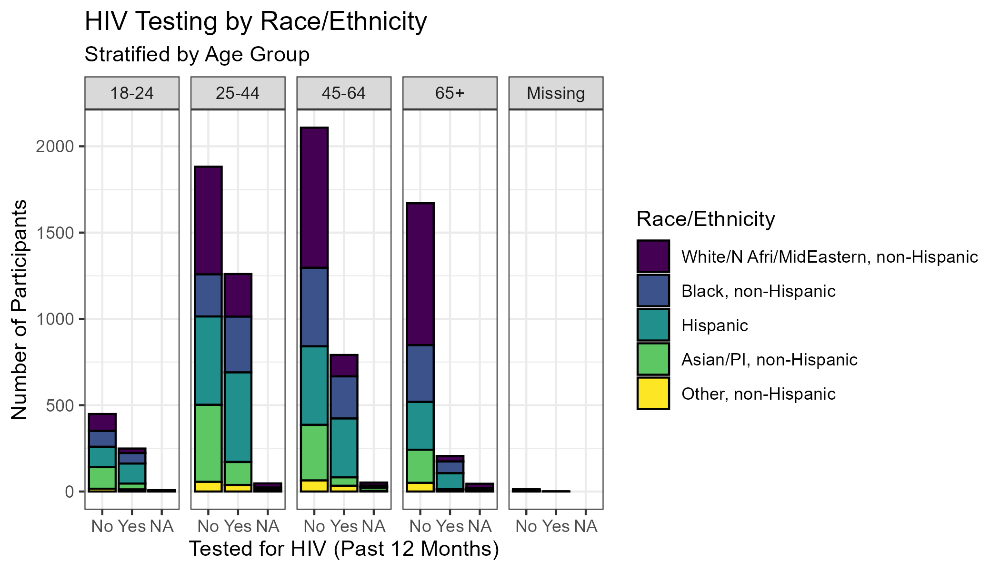
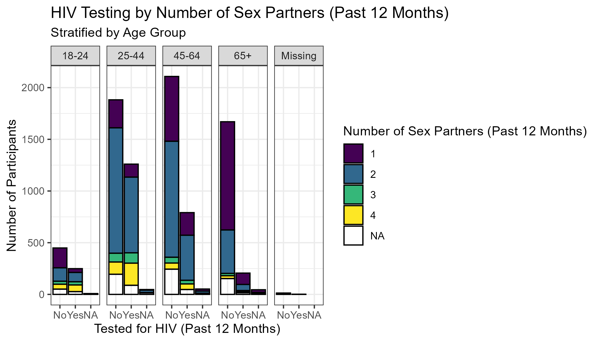

## 4.5 Summary Report

**Race/Ethnicity:** The largest group was White/North African/Middle
Eastern, non-Hispanic (32.6%), followed by Hispanic (28.0%), Black,
non-Hispanic (20.9%), Asian/Pacific Islander, non-Hispanic (15.3%), and
Other, non-Hispanic (3.3%).

**Age Group:** Most participants were aged 25–44 (36.3%) or 45–64
(33.6%), with smaller proportions aged 65+ (21.9%) and 18–24 (8.0%).

**HIV Testing (Past 12 Months):** 28.6% reported being tested for HIV in
the past year, while 69.7% had not been tested.

**Condom Use (Past 12 Months):** 17.3% reported using a condom the last
time they had sex, 40.7% did not, and 42.0% had missing data for this
question.

**Number of Sex Partners (Past 12 Months):** Nearly half (48.5%)
reported having 2 sex partners, 30.6% had 1 partner, and smaller
proportions reported 3 (4.3%) or 4 (6.8%) partners. About 9.8% had
missing data for this variable.

# 5. Statistical Modeling

## 5.1 Unadjusted Logistic Regression

This step was done to highlight the effect of confounded on p-value
significance. As you can see below there is an extremely signifncant
statistical association between condom HIV testing and condom use.
Condom use in the past 12 months was significantly associated with
higher odds of HIV testing in the past year (p \< 0.001).

    ## 
    ## Call:
    ## svyglm(formula = `Tested for HIV (Past 12 Months)` ~ `Condom Use (Past 12 Months)`, 
    ##     design = chs.dsgn, family = quasibinomial())
    ## 
    ## Survey design:
    ## svydesign(ids = ~1, strata = ~strata, weights = ~wt21_dual, data = chs20_recode, 
    ##     nest = TRUE, na.rm = TRUE)
    ## 
    ## Coefficients:
    ##                                  Estimate Std. Error t value Pr(>|t|)    
    ## (Intercept)                      -0.75078    0.05229 -14.359  < 2e-16 ***
    ## `Condom Use (Past 12 Months)`Yes  0.49119    0.09332   5.263 1.47e-07 ***
    ## ---
    ## Signif. codes:  0 '***' 0.001 '**' 0.01 '*' 0.05 '.' 0.1 ' ' 1
    ## 
    ## (Dispersion parameter for quasibinomial family taken to be 1.072588)
    ## 
    ## Number of Fisher Scoring iterations: 4

## 5.2 Adjusted Logistic Regression

After adjusting for age group, race/ethnicity, and number of sex
partners, condom use was no longer significantly associated with HIV
testing in the past year (p = 0.34).

    ## 
    ## Call:
    ## svyglm(formula = `Tested for HIV (Past 12 Months)` ~ `Condom Use (Past 12 Months)` + 
    ##     `Age Group` + `Race/Ethnicity` + `Number of Sex Partners (Past 12 Months)`, 
    ##     design = chs.dsgn, family = quasibinomial())
    ## 
    ## Survey design:
    ## svydesign(ids = ~1, strata = ~strata, weights = ~wt21_dual, data = chs20_recode, 
    ##     nest = TRUE, na.rm = TRUE)
    ## 
    ## Coefficients:
    ##                                              Estimate Std. Error t value
    ## (Intercept)                                 -0.937320   0.178702  -5.245
    ## `Condom Use (Past 12 Months)`Yes             0.099512   0.105003   0.948
    ## `Age Group`25-44                             0.200233   0.166301   1.204
    ## `Age Group`45-64                            -0.397506   0.177955  -2.234
    ## `Age Group`65+                              -1.187429   0.257802  -4.606
    ## `Race/Ethnicity`Black, non-Hispanic          1.437544   0.130397  11.024
    ## `Race/Ethnicity`Hispanic                     1.327000   0.118557  11.193
    ## `Race/Ethnicity`Asian/PI, non-Hispanic       0.229180   0.175734   1.304
    ## `Race/Ethnicity`Other, non-Hispanic          0.729676   0.288983   2.525
    ## `Number of Sex Partners (Past 12 Months)`.L  0.862675   0.112311   7.681
    ## `Number of Sex Partners (Past 12 Months)`.Q -0.008584   0.149061  -0.058
    ##                                             Pr(>|t|)    
    ## (Intercept)                                 1.63e-07 ***
    ## `Condom Use (Past 12 Months)`Yes              0.3433    
    ## `Age Group`25-44                              0.2286    
    ## `Age Group`45-64                              0.0255 *  
    ## `Age Group`65+                              4.21e-06 ***
    ## `Race/Ethnicity`Black, non-Hispanic          < 2e-16 ***
    ## `Race/Ethnicity`Hispanic                     < 2e-16 ***
    ## `Race/Ethnicity`Asian/PI, non-Hispanic        0.1923    
    ## `Race/Ethnicity`Other, non-Hispanic           0.0116 *  
    ## `Number of Sex Partners (Past 12 Months)`.L 1.89e-14 ***
    ## `Number of Sex Partners (Past 12 Months)`.Q   0.9541    
    ## ---
    ## Signif. codes:  0 '***' 0.001 '**' 0.01 '*' 0.05 '.' 0.1 ' ' 1
    ## 
    ## (Dispersion parameter for quasibinomial family taken to be 1.051299)
    ## 
    ## Number of Fisher Scoring iterations: 4

## 5.3 Adjusted LRM Table

| Variable | Odds Ratio | Std. Error | z value | p-value | CI Lower | CI Upper |
|:--------------------------:|:-------:|:-------:|:-----:|:-----:|:-----:|:-----:|
| Intercept | 0.392 | 0.179 | -5.245 | 0.000 \* | 0.276 | 0.556 |
| `Condom Use (Past 12 Months)`Yes | 1.105 | 0.105 | 0.948 | 0.343 | 0.899 | 1.357 |
| `Age Group`25-44 | 1.222 | 0.166 | 1.204 | 0.229 | 0.882 | 1.693 |
| `Age Group`45-64 | 0.672 | 0.178 | -2.234 | 0.026 \* | 0.474 | 0.953 |
| `Age Group`65+ | 0.305 | 0.258 | -4.606 | 0.000 \* | 0.184 | 0.506 |
| `Race/Ethnicity`Black, non-Hispanic | 4.210 | 0.130 | 11.024 | 0.000 \* | 3.261 | 5.437 |
| `Race/Ethnicity`Hispanic | 3.770 | 0.119 | 11.193 | 0.000 \* | 2.988 | 4.756 |
| `Race/Ethnicity`Asian/PI, non-Hispanic | 1.258 | 0.176 | 1.304 | 0.192 | 0.891 | 1.775 |
| `Race/Ethnicity`Other, non-Hispanic | 2.074 | 0.289 | 2.525 | 0.012 \* | 1.177 | 3.655 |
| `Number of Sex Partners (Past 12 Months)`.L | 2.369 | 0.112 | 7.681 | 0.000 \* | 1.901 | 2.953 |
| `Number of Sex Partners (Past 12 Months)`.Q | 0.991 | 0.149 | -0.058 | 0.954 | 0.740 | 1.328 |

Adjusted Logistic Regression Results: Odds Ratios and 95% Confidence
Intervals

# 6. Discussion

**LRM:** Without accounting for hypothesized confounders (age, race, \#
of partners) the association of HIV testing and condom usage is
significant. In relation to adjusting for the hypothesized confounders
we can see that participants who used condoms the last time the had sex
compared to those who didn’t had a 0.09951 increase in the log odds of
having HIV testing with in the last 12 months. However, the positive
association is not significant as the p-value is 0.3433.

# 7. Conclusion

Participants are more likely to have HIV testing done if they identify
as: Black- non-Hispanic, Hispanic, or Other-non-Hispanic, compared to
the other ethno-racial groups. Survey participants were less likely to
HIV testing done if they were aged: 45-64, 65+ as opposed to the other
age groups. Furthermore, there is a positive linear relationship between
the number of sex partners and HIV testing meaning the more sex partners
someone has the more likely a participant is to have HIV testing done.

# 8. Refrences and Resources

**Disclaimer:** This project was completed as a part of my
Bio-statistics II course with Dr. Levi Waldron. This was submitted under
Assignment 1 for the class however, this is an updated and completely
reformed version of the assignment with the visual models and commentary
being an addition. Materials and set up for this project are entirely
organized by Dr. Waldron who is a Professor at City University of New
York School of Public Health and Health Policy, and the Department
Chairperson of Epidemiology and Bio-statistics.

**Libraries Used**

-   Wickham, H. & Miller, E. (2024). haven: Import and Export ‘SPSS’,
    ‘Stata’ and ‘SAS’ Files. R package version 2.5.4.
    <https://CRAN.R-project.org/package=haven>

-   Wickham, H., François, R., Henry, L., & Müller, K. (2023). dplyr: A
    Grammar of Data Manipulation. R package version 1.1.4.
    <https://CRAN.R-project.org/package=dplyr>

-   Lumley, T. (2024). survey: analysis of complex survey samples. R
    package version 4.3-2. <https://CRAN.R-project.org/package=survey>

-   Harrell, F.E. Jr. (2024). Hmisc: Harrell Miscellaneous. R package
    version 5.1-1. <https://CRAN.R-project.org/package=Hmisc>

-   Rich, B. (2023). table1: Tables of Descriptive Statistics in HTML. R
    package version 1.4.4. <https://CRAN.R-project.org/package=table1>

-   Wickham, H. (2016). ggplot2: Elegant Graphics for Data Analysis.
    Springer-Verlag New York. <https://ggplot2.tidyverse.org/>

-   Wickham, H. (2024). forcats: Tools for Working with Categorical
    Variables (Factors). R package version 1.0.1.
    <https://CRAN.R-project.org/package=forcats>

-   Robinson, D., Hayes, A., & Couch, S. (2024). broom: Convert
    Statistical Objects into Tidy Tibbles. R package version 1.0.5.
    <https://CRAN.R-project.org/package=broom>

-   Xie, Y. (2024). knitr: A General-Purpose Package for Dynamic Report
    Generation in R. R package version 1.46. <https://yihui.org/knitr/>

-   Zhu, H. (2024). kableExtra: Construct Complex Table with ‘kable’ and
    Pipe Syntax. R package version 1.4.0.
    <https://CRAN.R-project.org/package=kableExtra>

-   Garnier, S. (2024). viridis: Colorblind-Friendly Color Maps for R. R
    package version 0.6.5. <https://CRAN.R-project.org/package=viridis>
